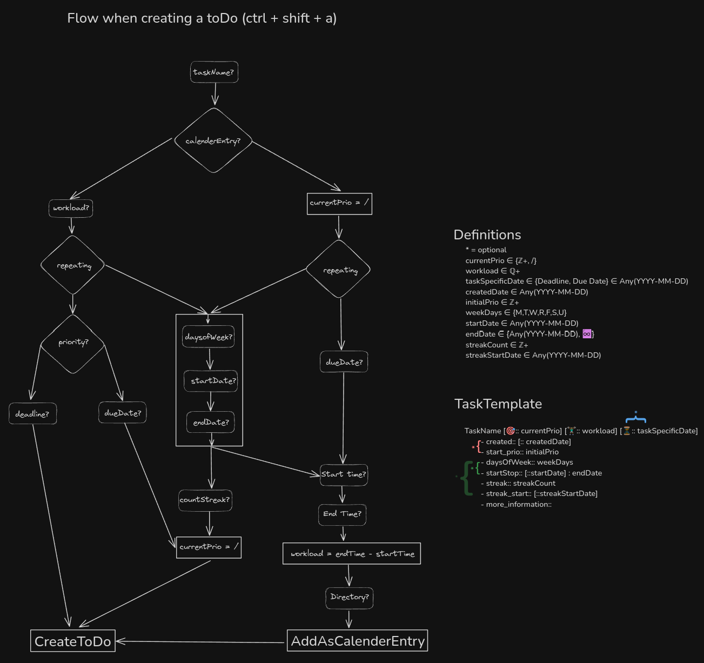

# Overview

## Guiding Principle
**“I see only one move ahead, but always the best move.” ~ José Raúl Capablanca**

There is no need to keep future tasks in mind, because we can work on one task at a time. But how do we know which one that is?

## What problem does this system solve?
**On what tasks should I work today?**

There is a correct solution to this problem: take all available tasks, sort them by priority, and work from top to bottom.
But you don’t want to reassign priorities and sort your tasks manually from scratch every day.

## The core of my system
1. Dynamically set priorities  
2. Fetch all tasks for the current day that fit into the specified workload window (default: 10 h)  
3. Smooth integration into Obsidian vaults  
4. Compatibility with the calendar  
5. User-friendly task creation with set-and-forget functionality  
6. Gamification with streak systems  
7. Support for repetitive tasks

# Setup Explanation
First, the **Templater** plugin is needed so we can use our custom [Template-ToDo](Template-ToDo.md) to set up new tasks.

It’s also important to set up tasks within a file starting with `ToDo-*`, so we can successfully fetch all tasks within our overview file [Planner](Planner.md). To give an overview of our calendar and tasks for the day, I use **DataviewJS**.

The final piece of the puzzle is my personal plugin **obsidian-todo-manager-plugin**. This plugin updates tasks automatically on startup when necessary. All necessary files can be found on [GitHub](https://github.com/lxflk/custom-obsidian).

# Technical details
Here I go into detail about how I implemented everything, so it’s easier to update my setup in the future.  
Note: for normal daily usage, it’s not necessary to understand all of this. The system is set up so you provide what you know about the task, and everything else is configured automatically in the background.

## How to create a new task

## What is covered?

- **Fetching daily tasks**
  - There is a daily workload window (10 h by default).
  - Tasks with priority **1** are always shown, regardless of how much workload is already allocated.
  - Then we fill the remaining workload by priority until we reach the specified workload window.

- **Calendar entries**
  - Every calendar entry is a todo, but not every todo is a calendar entry. The user should be able to create calendar entries based on the current todo layout to synchronize the calendar with the todo system.
  - Essentially, a calendar entry is a normal todo with a specific time window during which the task should be completed.

- **Dynamic priorities**
  - **Deadlines**
    - If there is a deadline, we increase the initial priority set by the user day by day from task creation, and set it to **1** starting two days prior to the deadline.
  - **Due dates**
    - Some tasks must be finished on a specific day. These tasks have no priority until that day is reached, at which point they receive the maximum priority (**1**).
  - **Recurring tasks**
    - These tasks are always priority **1** when we are within the defined start–stop range and the current day is part of their recurrence schedule (based on defined weekdays). Note that we reset these tasks only if the todo has been checked.

- **Streaks**
  - Recurring tasks can have streaks.
  - The plugin evaluates the expected streak count based on the given streak start and recurrence schedule. We always exclude the current day for this calculation. If the current streak does not match the expected streak, we reset it to **0**.
